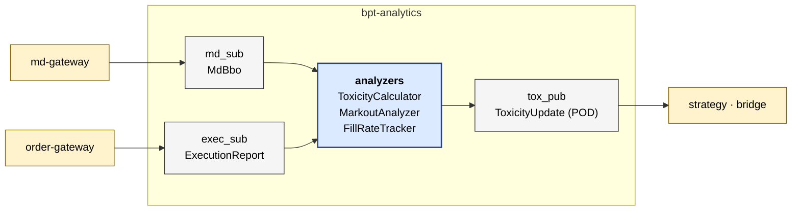

# bpt-analytics

Live trading analytics — markouts, toxicity scoring, fill-rate, time-to-fill.
Consumes MD BBO + exec reports; emits `ToxicityUpdate` POD messages. Pure
internal-consumer service.

See [service-anatomy.md](../docs/service-anatomy.md) for the canonical service shape.

## At a glance



## Streams produced

| Stream | ID | Contents | Cadence |
|---|---|---|---|
| `toxicity` | 5001 | `ToxicityUpdate` (POD, not SBE — fixed-layout struct) | ~Hz per active instrument |

## Streams consumed

| Stream | ID | Contents |
|---|---|---|
| `md_data` | 2002 | `MdBbo` |
| `exec_report` | 3002 | `ExecutionReport` |

## Layers (which this service has)

| Layer | Status | Notes |
|---|---|---|
| Composition root | yes | `src/main.cpp` |
| Service | yes | `app/analytics_service.{h,cpp}` |
| Bus | yes | `messaging/aeron_bus.{h,cpp}` — `AnalyticsBus` |
| Routing | **no** | — |
| Adapter | **no** | — |
| Wire | **no** | — |
| External codec | **no** | — |
| Pub/Sub (slow) | yes | `publishers/{api,aeron}/toxicity_publisher.h`, `subscribers/{api,aeron}/...` |
| Pub (hot) | **no** | — |
| Internal codec | yes | `messaging/codecs/pod_toxicity_codec.{h,cpp}` (POD memcpy codec — fixed-layout struct, not SBE) |
| Domain logic | yes | `analysis/` — `ToxicityCalculator`, `MarkoutAnalyzer`, `FillRateTracker`, `TimeToFillTracker` |

## Concepts used

- `bpt::common::codec::Codec<C, T>` — `PodToxicityCodec` satisfies it.

## Test seams

- Unit: `tests/unit/` — per-analyzer (markout, fill-rate, etc.)
- No component tests (no external venue).

## POD codec vs SBE codec

Most internal codecs are SBE-encoded (versioned, variable-length). Toxicity
is a small fixed-layout POD with no nested types or strings, so the codec
is a memcpy round-trip — same `Codec<C, T>` contract, different
implementation. See `PodToxicityCodec`.

## Reading order

1. `src/main.cpp`
2. `app/analytics_service.{h,cpp}` — main poll loop, wires subs to analyzers, drives publish cadence.
3. `messaging/aeron_bus.{h,cpp}` — `AnalyticsBus` shape.
4. `analysis/toxicity_calculator.h` — the headline analytic.

## Build + test

```bash
bazel build //bpt-analytics:bpt-analytics
bazel test //bpt-analytics/...
```
