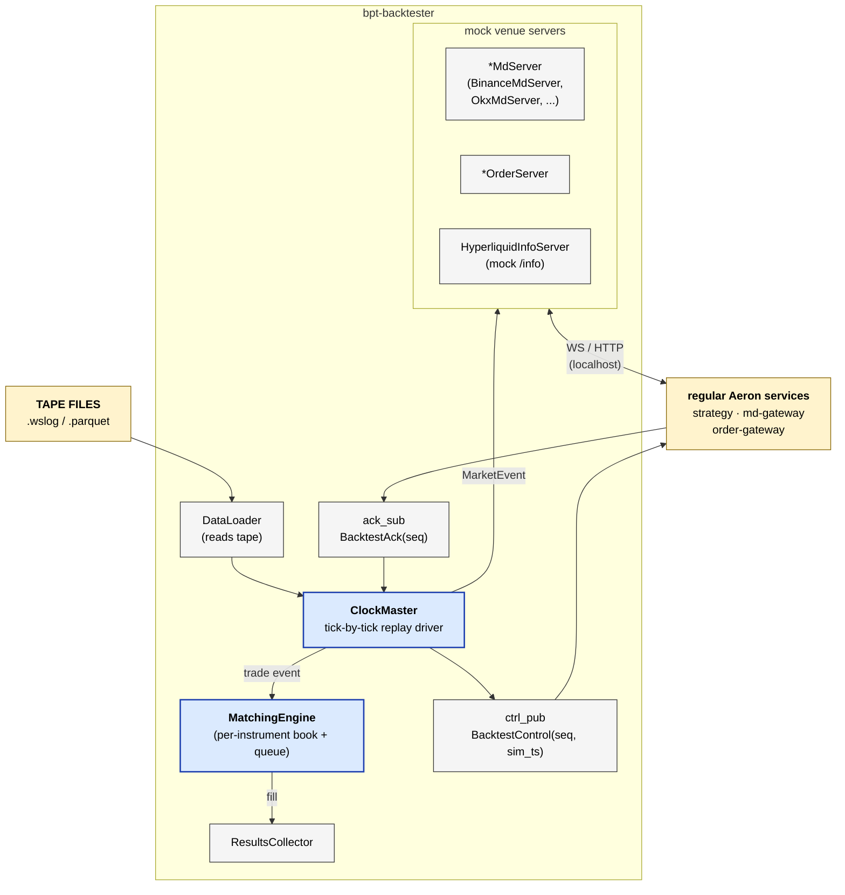
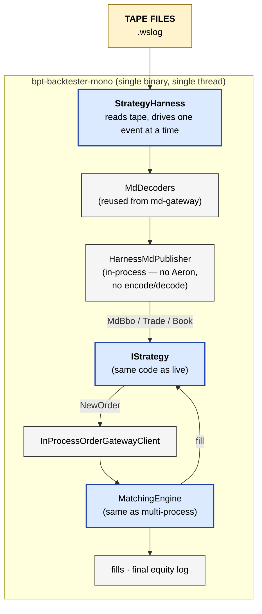

# bpt-backtester

Backtest harness. Two distinct binaries:

- **`bpt-backtester`** (multi-process) — runs as a normal Aeron service.
  Drives mock exchange WS servers + matching engine; replays tape into
  the live wire so the strategy runs unmodified. Acts as the integration
  smoke test for the wire.

- **`bpt-backtester-mono`** (single-process, deterministic) — strategy +
  matching engine + clock all in one thread, no Aeron. The measurement
  device for parameter tuning.

See [service-anatomy.md](../docs/service-anatomy.md) for the canonical service shape.

## At a glance — bpt-backtester (multi-process)



## At a glance — bpt-backtester-mono (deterministic)



## Streams produced (multi-process)

| Stream | ID | Contents | Cadence |
|---|---|---|---|
| `backtest_control` | 9002 | `BacktestControl(seq, sim_ts)` — replay tick gate | per tick |

## Streams consumed (multi-process)

| Stream | ID | Contents |
|---|---|---|
| `backtest_ack` | 9001 | `BacktestAck(seq)` — strategy ack'd this tick |

## Layers (which this service has)

### bpt-backtester (multi-process)

| Layer | Status | Notes |
|---|---|---|
| Composition root | yes | `src/main.cpp` |
| Service | yes | `app/backtester_service.{h,cpp}` |
| Bus | yes | `messaging/aeron_bus.{h,cpp}` — `BacktesterBus` (ctrl_pub + ack_sub) |
| Routing | **no** | — |
| Adapter | **special** | mock venue servers, not real adapters. Per-venue: `BinanceMdServer`, `OkxOrderServer`, `HLInfoServer`, etc. |
| Wire | yes | the mock servers listen on local TCP — actual WS / HTTP servers using Boost.Beast |
| External codec | yes | mock servers emit venue JSON; strategy's adapters in md-gateway decode it normally |
| Pub/Sub (slow) | yes | 1 pub + 1 sub, api/aeron split |
| Pub (hot) | **no** | — |
| Internal codec | yes | `messaging/codecs/sbe_backtest_*.{h,cpp}` |
| Domain logic | yes | `data/` (DataLoader for tape replay), `clock/` (ClockMaster), `matching/` (MatchingEngine + book), `exchange/` (per-venue mock WS/HTTP servers), `results/` (collector + summary), `latency/` (configurable latency injector) |

### bpt-backtester-mono (single-process)

Drops most layers — the harness is a small library that wires strategy +
matching engine + tape replay end-to-end. See `harness/strategy_harness.h`
and `harness/inprocess_order_gateway_client.h`.

## The two binaries — why both

- The multi-process binary exercises the full wire (Aeron, SBE, WS clients,
  the whole stack). Catches integration bugs. Slow per-event because every
  message round-trips through shared memory + Java MediaDriver + decode.
- The mono binary is the measurement device. Same strategy code, same
  config, but no IPC means each tick is microseconds instead of
  milliseconds. Parameter sweeps that would take hours in multi-process
  finish in minutes here.

Tradeoff: mono can drift from multi-process behaviour over time if either
side changes the publish chain. We accept the drift and run both
periodically to verify they agree.

## Reading order

For multi-process:
1. `src/main.cpp`
2. `app/backtester_service.{h,cpp}` — wires DataLoader + ClockMaster + mocks.
3. `clock/clock_master.{h,cpp}` — the tick replay driver.
4. `data/data_loader.{h,cpp}` — reads tape, produces `MarketEvent` stream.
5. `matching/matching_engine.{h,cpp}` — per-instrument order book + fill logic.
6. `exchange/binance/binance_md_server.{h,cpp}` — example mock venue server.

For mono:
1. `src/main_mono.cpp`
2. `harness/strategy_harness.{h,cpp}` — the in-process driver.
3. `harness/inprocess_order_gateway_client.{h,cpp}` — strategy's order client without Aeron.

## Build

```bash
# multi-process — broken right now (HyperliquidMdDecoder signature drift)
bazel build //bpt-backtester:bpt-backtester

# mono — same blocker, plus kOrderBookDepth unqualified ref in test
bazel build //bpt-backtester:bpt-backtester-mono
bazel build //bpt-backtester:backtester_core  # core lib only — clean

# unit tests for core (config, matching, results)
bazel test //bpt-backtester:backtester_unit_tests
```

There are two pre-existing build issues (orthogonal to recent refactors):
- `strategy_harness.cpp`'s call to `HyperliquidMdDecoder::decode` is missing the
  `InstrumentStatsCallback` arg added in commit `8b62a7a`.
- `test_matching_engine.cpp:621` references `kOrderBookDepth` unqualified.

Both are fix-by-touching-2-lines but haven't been done yet. See
[`docs/backlog.md`](../docs/backlog.md) for current state.
