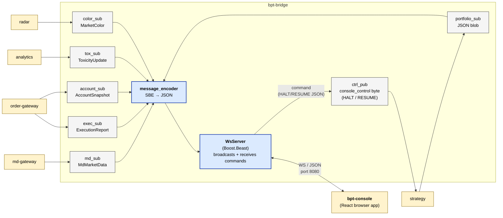

# bpt-bridge

Aeron → WebSocket forwarder. Subscribes to 6 Aeron streams, translates SBE
to JSON, broadcasts over WebSocket to `bpt-console` (the React trading
console). The only service where the "external wire" is the operator's
browser instead of an exchange.

See [service-anatomy.md](../docs/service-anatomy.md) for the canonical service shape.

## At a glance



## Streams consumed (Aeron, inbound)

| Stream | ID | Contents |
|---|---|---|
| `md_data` | 2002 | `MdMarketData` (BBO) |
| `exec_report` | 3002 | `ExecutionReport` (decoded to `Fill` + `OrderEvent`) |
| `account_snapshot` | 3004 | `AccountSnapshot` (positions + balances) |
| `portfolio` | 9004 | JSON portfolio snapshots from strategy (multi-fragment, reassembled) |
| `toxicity` | 5001 | `ToxicityUpdate` |
| `market_color` | 6002 | `MarketColor` |

## Streams produced (Aeron, outbound)

| Stream | ID | Contents | Cadence |
|---|---|---|---|
| `console_control` | 9003 | 1-byte HALT (0x00) / RESUME (0x01) | on operator click |

## External wire

| Endpoint | Protocol | Direction |
|---|---|---|
| `ws://localhost:8080` | WebSocket / JSON | bridge → console: broadcasts |
| `ws://localhost:8080` | WebSocket / JSON commands | console → bridge: `{"kind":"halt"}` / `{"kind":"resume"}` |

JSON message kinds: `session`, `status`, `tick`, `fill`, `order`, `position`,
`toxicity`, `marketColor`. Schema in `bpt-console/frontend/src/types/messages.ts`.

## Layers (which this service has)

| Layer | Status | Notes |
|---|---|---|
| Composition root | yes | `src/main.cpp` |
| Service | yes | `app/bridge_service.{h,cpp}` — owns the event handlers |
| Bus | yes | `messaging/aeron_bus.{h,cpp}` — `BridgeBus` |
| Routing | **no** | one operator, one console |
| Adapter | **special** | the "adapter" equivalent is `WsServer` (outbound to console) — not an exchange |
| Wire | **yes** | `ws/ws_server.{h,cpp}` (Boost.Beast WebSocket server) |
| External codec | **yes** | `ws/message_encoder.{h,cpp}` — domain → JSON |
| Pub/Sub (slow) | yes | 1 publisher + 6 subscribers, all api/aeron split |
| Pub (hot) | **no** | — |
| Internal codec | **no** | all SBE decode is inline in the aeron subscribers |
| Domain logic | yes | `state/position_tracker.{h,cpp}` (running PnL), `aeron/sbe_decode.h` (decode helpers) |

## Special shape: WS server instead of WS client

Every other external-facing bpt-* service is a **client** to an external
WebSocket (the exchange). Bridge is the inverse — it **runs** a WebSocket
server that the console connects to.

That means:
- `ws/ws_server.h` plays the role md-gateway's `*MdWsClient` plays in
  reverse: it accepts inbound connections and broadcasts to all of them.
- `ws/message_encoder.h` plays the role of md-gateway's `*MdEncoder` —
  building outbound text (JSON instead of subscription URLs).
- There's no "decoder" sibling, but the WsServer does parse short text
  commands inbound (`{"kind":"halt"}`) — handled inline in `WsServer` and
  surfaced via `IBroadcaster::set_command_handler`.

## Test seam

`tests/unit/test_bridge_service_seam.cpp` — drives `BridgeService::on_*`
handlers directly with `FakeBroadcaster` + `FakeCtrlSink` (the latter
inherits `api::ConsoleControlPublisher`). No Aeron driver, no real
WebSocket listener. Verifies decode + broadcast for each input stream
and the HALT/RESUME command flow.

## Reading order

1. `src/main.cpp` — composition root, wires WsServer + BridgeService + AeronBus.
2. `app/bridge_service.{h,cpp}` — the `on_*` event handlers. The seam test drives these directly.
3. `messaging/aeron_bus.{h,cpp}` — `BridgeBus` shape (6 inbound subs + 1 outbound pub).
4. `ws/message_encoder.{h,cpp}` — SBE→JSON translation logic. Per-kind builders.
5. `ws/ws_server.{h,cpp}` — Boost.Beast WebSocket server, connection management.

## Build + test

```bash
bazel build //bpt-bridge:bpt-bridge
bazel test //bpt-bridge:bridge_seam_tests
```
