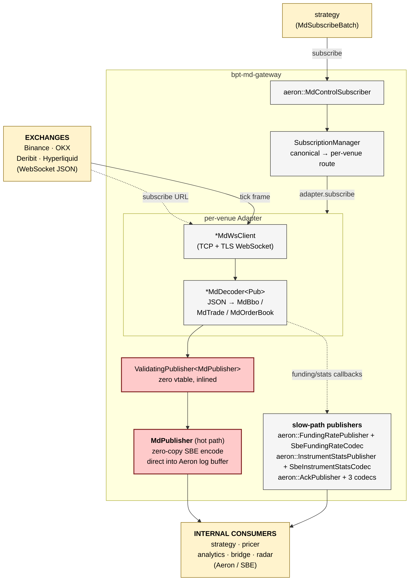

# bpt-md-gateway

Market-data gateway: subscribes to exchange WebSocket feeds (Binance / OKX /
Deribit / Hyperliquid), normalises into SBE messages, publishes on Aeron to
strategy + pricer + analytics + bridge + radar.

See [service-anatomy.md](../docs/service-anatomy.md) for the canonical
layered shape every bpt-* service follows. This README shows the specific
shape this service has.

## At a glance



## Streams produced

| Stream | ID | Contents | Cadence |
|---|---|---|---|
| `md_data` | 2002 | MdBbo, MdTrade, MdOrderBook (SBE) | kHz per active instrument |
| `md_ack_hb` | 2003 | MdSubscriptionAck, MdSubscriptionHeartbeat, MdServiceHeartbeat | Hz |
| `funding_rate` | 1005 | FundingRate updates | ~Hz per perp instrument |
| `instrument_stats` | 2004 | InstrumentStats (OI, mark, index, last, 24h vol) | per-instrument ~10s |

## Streams consumed

| Stream | ID | Contents |
|---|---|---|
| `md_control` | 2001 | MdSubscribeBatch from strategy (the only inbound) |

## Layers (canonical shape)

| Layer | Code location | Files |
|---|---|---|
| Composition root | `src/main.cpp` | — |
| Service | `app/md_gateway_service.{h,cpp}` | `MdGatewayService` (IService impl) |
| Bus | `messaging/aeron_bus.{h,cpp}` | `MdGatewayBus` struct + `build()` factory |
| Routing | `subscription/subscription_manager.{h,cpp}` | `SubscriptionManager` |
| Adapter | `adapter/<venue>/<venue>_md_adapter.{h,cpp}` | 4 adapters, share `adapter/common/adapter_base.h` |
| Wire | `adapter/<venue>/<venue>_md_ws_client.{h,cpp}` | Boost.Beast + Asio WS |
| External codec | `adapter/<venue>/<venue>_md_decoder.h` (header-only template), `<venue>_md_encoder.{h,cpp}` | simdjson decoder, free-function encoder |
| Pub/Sub (slow) | `messaging/publishers/{api,aeron}/...`, `messaging/subscribers/{api,aeron}/...` | api/aeron split |
| Pub (hot) | `messaging/publishers/md_publisher.{h,cpp}` | `MdPublisher` (templated chain target) |
| Internal codec | `messaging/codecs/sbe_*.{h,cpp}` | All satisfy `Codec<C, T>` |
| Hot-path support | `md/{md_encoder,md_validator,md_types,md_publisher_concept,validating_publisher,...}.h` | CRTP / template chain pieces |

## Concepts

| Concept | Where defined | Used by |
|---|---|---|
| `MdSink<P>` | `md/md_publisher_concept.h` | All 4 venue decoders constrain their `Pub` template param |
| `MdPublisher<P>` | `md/md_publisher_concept.h` | `ValidatingPublisher<Inner>` constrains `Inner` |
| `Codec<C, T>` | `bpt-common/include/bpt_common/codec/codec.h` | All slow-path SBE codecs verify via `static_assert` |

## Test seams

- **Component tests**: `tests/component/test_<venue>_adapter.cpp` — captured JSON fragments → expected SBE output. Uses `FakeMdPublisher` (satisfies `MdSink` concept without inheriting any port).
- **Unit tests**: `tests/unit/test_*.cpp` — codec round-trips, validator, drop-breaker, subscription manager.
- **Component test fake for AckPublisher**: `tests/component/fake_ack_publisher.h` — inherits `api::AckPublisher` port.

## Hot path vs slow path summary

| | Hot path | Slow path |
|---|---|---|
| What | MD ticks (BBO/Trade/OrderBook) | Funding rate, instrument stats, acks, heartbeats |
| Rate | kHz per instrument | Hz to 0.01 Hz |
| Dispatch | Template composition + concept (`MdSink`) | Virtual port (api/aeron split) |
| Encode | Zero-copy SBE via `MdPublisher::tryClaim` | `Codec<C,T>::encode(obj, scratch)` then `offer` |
| Vtable hops | 0 | 1 per publish |
| Files | `md/*.h`, `messaging/publishers/md_publisher.h` | `messaging/publishers/{api,aeron}/...` |

## Reading order for new contributors

1. **`src/main.cpp`** — what gets wired up (composition root).
2. **`app/md_gateway_service.{h,cpp}`** — the poll loop. See how `bus_` is consumed.
3. **`messaging/aeron_bus.{h,cpp}`** — what the bus owns (one struct field per stream this service produces/consumes).
4. **`adapter/common/i_adapter.h`** — adapter contract. The file's `@file` doc has an ASCII picture of the per-venue stack.
5. **`adapter/binance/binance_md_adapter.h`** — concrete venue adapter. Other 3 venues follow the same shape.
6. **`adapter/binance/binance_md_decoder.h`** — concept-constrained template doing JSON→domain.
7. **`md/validating_publisher.h`** — the template wrapper between decoder and `MdPublisher`. Hot-path chain visible here.
8. **`messaging/publishers/md_publisher.h`** — zero-copy SBE encode + Aeron `tryClaim`.

Everything else (subscription manager, individual SBE codecs, per-venue exec
decoders) follows from those eight files.

## Build + test

```bash
bazel build //bpt-md-gateway:bpt-md-gateway
bazel test //bpt-md-gateway/...      # unit + component tests
```

Hot-path latency target: BBO JSON-frame to MD-stream offer in <10 µs p50 on
warm-cache. Measured via `BinanceMdDecoder::decode_lat_` histogram; sampled
to Prometheus every 5 s.
