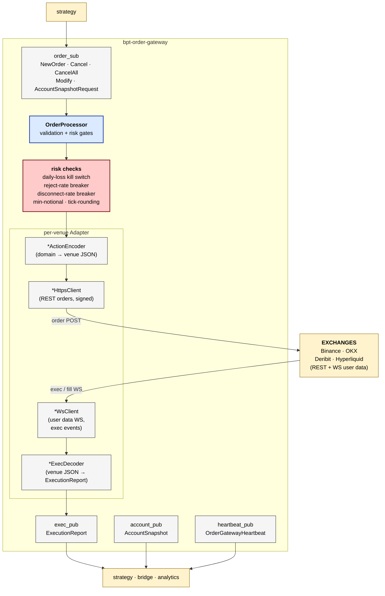

# bpt-order-gateway

Order routing gateway. Receives `NewOrder` / `Cancel` / `Modify` from
strategy; routes to the correct venue (Binance / OKX / Deribit / Hyperliquid)
over REST or WebSocket; publishes `ExecutionReport` and `AccountSnapshot`
back to strategy. Owns risk + circuit breakers in-process (no separate
risk service).

See [service-anatomy.md](../docs/service-anatomy.md) for the canonical service shape.

## At a glance



## Streams produced

| Stream | ID | Contents | Cadence |
|---|---|---|---|
| `exec_report` | 3002 | `ExecutionReport` (ack / fill / partial / reject / cancel) | per exec event |
| `account_snapshot` | 3004 | `AccountSnapshot` (positions + currency balances) | 5s + on-demand |
| `heartbeat` | 3003 | `OrderGatewayHeartbeat` (venue bitmask + open-order count) | Hz |

## Streams consumed

| Stream | ID | Contents |
|---|---|---|
| `order` | 3001 | `NewOrder` / `CancelOrder` / `CancelAll` / `ModifyOrder` / `AccountSnapshotRequest` |

## Layers (which this service has)

| Layer | Status | Notes |
|---|---|---|
| Composition root | yes | `src/main.cpp` |
| Service | yes | `app/order_gateway_service.{h,cpp}` |
| Bus | yes | `messaging/aeron_bus.{h,cpp}` — `AeronBus` |
| Routing | yes | per-venue adapter map (instrument_id → venue resolved via refdata) |
| Adapter | yes | `adapter/<venue>/<venue>_order_adapter.{h,cpp}` — 4 venues, share `adapter/common/order_adapter_base.{h,cpp}` |
| Wire | yes | `adapter/<venue>/<venue>_https_client.{h,cpp}` (REST orders) + `*_ws_client.{h,cpp}` (user-data WS for exec events) |
| External codec | yes | `*_action_encoder.{h,cpp}` (free functions, no concept) + `*_exec_decoder.{h,cpp}` (JSON → ExecutionReport) |
| Pub/Sub (slow) | yes | 3 publishers + 1 subscriber, all api/aeron split |
| Pub (hot) | **no** | — |
| Internal codec | yes | `messaging/codecs/sbe_*.{h,cpp}` — satisfies `Codec<C, T>` |
| Domain logic | yes | `order/` (OrderProcessor, OrderStateManager), `risk/` (PnlTracker, RejectRateBreaker, DisconnectRateBreaker), `refdata/` (instrument cache for tick/notional rules), `metrics/` |

## The encoder/decoder asymmetry

Unlike md-gateway (where the decoder is the hot path and templated +
concept-constrained), order-gateway has:

- **Encoder** = pure free functions returning `std::string`. Not templates,
  no concept. Each venue's encoder has different signing semantics
  (HMAC for Binance, secp256k1 for HL, OAuth for Deribit, prehashed for OKX)
  so the encoder shape is venue-specific.

- **Decoder** = concrete class per venue (e.g. `BinanceExecDecoder`). Parses
  inbound exec events from the venue's user-data WS, normalises to
  `ExecutionReport`. Single message type per decoder (vs MD's multi-dispatch).

No concept on either side — both are concrete classes / free functions
used directly. See [api-aeron-sim-layout.md](../site/docs/decisions/api-aeron-sim-layout.md)
for why concepts cluster at template boundaries only.

## Risk in-process

Risk checks run inside `OrderProcessor` before every adapter call:
- **Daily-loss kill switch** — once cumulative realized PnL crosses
  `-max_daily_loss_usd`, latches `trading_enabled_ = false` and all
  subsequent `NewOrder` requests reject as `RISK_REJECTED`.
- **Reject-rate breaker** — rolling window; trip if reject ratio
  exceeds threshold.
- **Disconnect-rate breaker** — same shape, tracking WS disconnect events.
- **Min-notional + tick-rounding** — per-instrument via refdata cache.

Future split into a `bpt-risk` service is documented in
[`decisions/index.md`](../site/docs/decisions/index.md) as not-yet-decided.

## Test seams

- Unit: `tests/unit/` — risk components (PnlTracker, breakers), order state.
- `test_order_processor_risk_latch.cpp` — feeds synthetic ExecEvents through
  OrderProcessor, asserts the kill switch latches at the right threshold and
  subsequent NewOrders reject. Uses `CapturingExecReportPublisher` (inherits
  `api::ExecReportPublisher`).

## Reading order

1. `src/main.cpp`
2. `app/order_gateway_service.{h,cpp}` — poll loop, fan-in from adapters, periodic snapshot.
3. `messaging/aeron_bus.{h,cpp}` — `AeronBus` shape.
4. `adapter/common/i_order_adapter.h` — venue adapter contract.
5. `adapter/binance/binance_order_adapter.{h,cpp}` — concrete adapter; encoder + decoder visible.
6. `order/order_processor.{h,cpp}` — risk gates, order lifecycle.
7. `risk/` — the breakers + PnL tracker.

## Build + test

```bash
bazel build //bpt-order-gateway:bpt-order-gateway
bazel test //bpt-order-gateway:order_gateway_unit_tests
```
