# bpt-pms

Position management service. Polls one or more venues' balance + position
endpoints, normalises into a multi-venue `BalanceSnapshot`, publishes on
Aeron. Smaller cousin of bpt-refdata — same external-REST shape, narrower
surface.

See [service-anatomy.md](../docs/service-anatomy.md) for the canonical service shape.

## At a glance

```mermaid
%%{init: {
  'theme': 'base',
  'themeVariables': {
    'fontFamily': '"SF Mono", "JetBrains Mono", "Cascadia Code", Consolas, monospace',
    'fontSize': '14px',
    'lineColor': '#475569',
    'primaryColor': '#1e293b',
    'primaryTextColor': '#f8fafc',
    'primaryBorderColor': '#0f172a'
  }
}}%%
flowchart LR
    hl["<b>Hyperliquid /info</b><br/>(clearinghouse state)"]
    consumers["strategy · console<br/>(cross-venue position view)"]

    subgraph pms["bpt-pms"]
        https["BeastHttpsClient<br/>(signed POST)"]
        parser["JSON parser<br/>→ BalanceSnapshot"]
        service["<b>PmsService</b><br/>(polls on cadence)"]
        snapshot_pub["snapshot_pub<br/>BalanceSnapshot SBE"]

        https --> parser
        parser --> service
        service --> snapshot_pub
    end

    hl -->|"POST /info"| https
    snapshot_pub --> consumers

    classDef external fill:#fff3cd,stroke:#856404,color:#000
    classDef domain fill:#dbeafe,stroke:#1e40af,stroke-width:2px,color:#000
    classDef layer fill:#f5f5f5,stroke:#333,color:#000
    class hl,consumers external
    class service domain
    class https,parser,snapshot_pub layer
```



## Streams produced

| Stream | ID | Contents | Cadence |
|---|---|---|---|
| `balance_snapshot` | 8001 | `BalanceSnapshot` (positions + per-currency balances, multi-venue) | per poll interval (~5-30s) |

## Streams consumed

None — pms is pure outbound.

## Layers (which this service has)

| Layer | Status | Notes |
|---|---|---|
| Composition root | yes | `src/main.cpp` |
| Service | yes | `app/pms_service.{h,cpp}` |
| Bus | yes | `messaging/aeron_bus.{h,cpp}` — `PmsBus` (one field: `snapshot_pub`) |
| Routing | **no** | — |
| Adapter | yes | `adapter/hyperliquid_balance_adapter.{h,cpp}` (HL is the only adapter today) |
| Wire | yes | inline `BeastHttpsClient` usage inside the adapter (no shared wire class — small surface) |
| External codec | yes | venue JSON → `BalanceSnapshot` inline in the adapter |
| Pub/Sub (slow) | yes | 1 publisher (api/aeron split) |
| Pub (hot) | **no** | — |
| Internal codec | yes | `messaging/codecs/sbe_balance_snapshot_codec.{h,cpp}` |
| Domain logic | minimal | `adapter/balance_row.h` — domain types for the snapshot |

## Why pms is small

Compared to bpt-refdata which has 4 venue adapters and a registry, pms has
one (HL). Other venues' balances come via bpt-order-gateway's
`AccountSnapshot` stream (which is venue-by-venue, separate stream
identity per venue). pms exists for the cross-venue aggregation case + as
the dedicated subscriber for HL's `clearinghouseState` info-API endpoint
(which the order-gateway doesn't poll).

The architecture is positioned to grow more adapters if you wanted a
unified balance/position view across all venues from one place — but
today, only HL.

## Auxiliary binary: `balance_peek`

`tools/balance_peek.cpp` is a dev binary that subscribes to the
`balance_snapshot` stream and prints each row. Used to verify pms is
publishing without needing a strategy or the console wired up.

```bash
bazel build //bpt-pms:balance_peek
./bazel-bin/bpt-pms/balance_peek
```

## Reading order

1. `src/main.cpp`
2. `app/pms_service.{h,cpp}` — poll loop + publish on cadence.
3. `messaging/aeron_bus.{h,cpp}` — tiny `PmsBus` struct.
4. `adapter/hyperliquid_balance_adapter.{h,cpp}` — REST poll + JSON parse.
5. `adapter/balance_row.h` — output struct shape.

## Build + test

```bash
bazel build //bpt-pms:bpt-pms
```

No unit tests yet — covered indirectly by the balance_peek smoke check.
