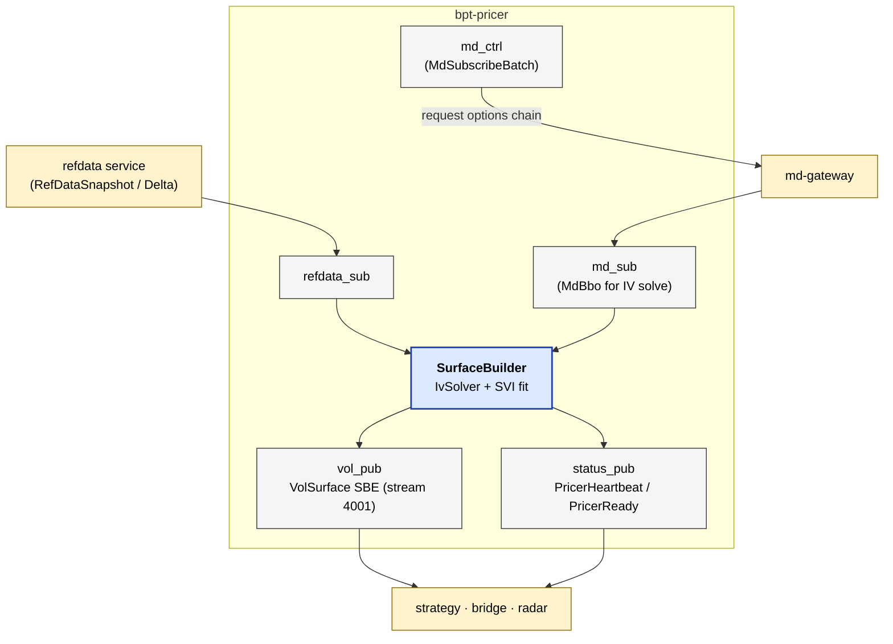

# bpt-pricer

Implied-volatility surface builder. Consumes refdata + MD ticks for options
instruments; computes Black-Scholes IV per strike; emits a `VolSurface` SBE
message every refresh interval. Pure internal-consumer service — no exchange
WebSocket adapters.

See [service-anatomy.md](../docs/service-anatomy.md) for the canonical service shape.

## At a glance



## Streams produced

| Stream | ID | Contents | Cadence |
|---|---|---|---|
| `vol_surface` | 4001 | `VolSurface` (per-strike IV grid for each underlying) | ~Hz per surface rebuild |
| `pricer_status` | 4002 | `PricerHeartbeat`, `PricerReady` | Hz / once |
| `md_control` | 2001 | `MdSubscribeBatch` (pricer is one of md-gateway's consumers) | on universe change |

## Streams consumed

| Stream | ID | Contents |
|---|---|---|
| `md_data` | 2002 | `MdBbo` for option instruments (for IV solve) |
| `refdata_snapshot` | 1001 | `RefDataSnapshot` (instrument universe) |
| `refdata_delta` | 1002 | `RefDataDelta` (instrument adds/removes/status) |

## Layers (which this service has)

| Layer | Status | Notes |
|---|---|---|
| Composition root | yes | `src/main.cpp` |
| Service | yes | `app/pricer_service.{h,cpp}` |
| Bus | yes | `messaging/aeron_bus.{h,cpp}` — `PricerBus` |
| Routing | **no** | no per-venue routing — pricer is venue-agnostic |
| Adapter | **no** | no exchange WebSocket |
| Wire | **no** | — |
| External codec | **no** | — |
| Pub/Sub (slow) | yes | `messaging/publishers/{api,aeron,sim}/`, `md/{api,aeron}/`, `refdata/{api,aeron}/` |
| Pub (hot) | **no** | — |
| Internal codec | yes | `messaging/codecs/sbe_*.{h,cpp}` |
| Domain logic | yes | `pricing/` (Black-Scholes, IV solver, SVI fit), `surface/` (grid builder) |

## Special: the `sim/` variant

Pricer is the first service to grow a `sim/` concrete:

```
messaging/publishers/api/vol_surface_publisher.h    →  api::VolSurfacePublisher
messaging/publishers/aeron/vol_surface_publisher.h  →  aeron::VolSurfacePublisher (prod)
messaging/publishers/sim/vol_surface_publisher.h    →  sim::VolSurfacePublisher (backtester)
```

`sim::VolSurfacePublisher` dispatches `std::function<void(VolSurfaceGrid&, uint64_t)>`
directly — no SBE encode, no Aeron offer. Used by `bpt-backtester-mono` when
running pricer in-process with the strategy.

## Concepts used

- `bpt::common::codec::Codec<C, T>` — every codec in `messaging/codecs/` self-verifies.

No hot-path concepts (`MdSink` / `MdPublisher`) — pricer doesn't have a
template chain.

## Test seams

- Unit: `tests/test_*.cpp` — Black-Scholes, IV solver, SVI, codec round-trip.
- `test_sim_vol_surface_publisher.cpp` — exercises the sim variant via the
  port (`api::VolSurfacePublisher`).
- No component tests (no external venue to fake).

## Reading order

1. `src/main.cpp`
2. `app/pricer_service.{h,cpp}` — main poll loop, consumes refdata + MD, runs `SurfaceBuilder`.
3. `messaging/aeron_bus.{h,cpp}` — `PricerBus` shape.
4. `surface/surface_builder.h` — per-underlying grid construction.
5. `pricing/iv_solver.h` + `pricing/svi.h` — the actual math.
6. `messaging/publishers/api/vol_surface_publisher.h` + `sim/` + `aeron/` — port pattern with sim variant.

## Build + test

```bash
bazel build //bpt-pricer:bpt-pricer
bazel test //bpt-pricer:pricer_tests
```
