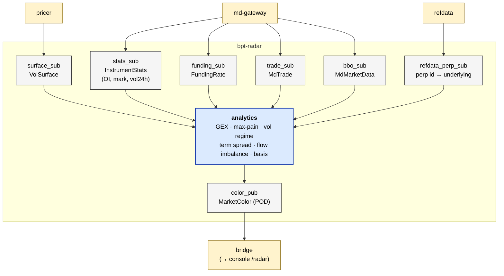

# bpt-radar

Market-color aggregator. Consumes 6 internal streams (vol surface, MD BBO + trades,
instrument stats, funding rate, refdata perp metadata); produces one
`MarketColor` POD per refresh interval. Powers the dashboard `/radar` route.

See [service-anatomy.md](../docs/service-anatomy.md) for the canonical service shape.

## At a glance



## Streams produced

| Stream | ID | Contents | Cadence |
|---|---|---|---|
| `market_color` | 6002 | `MarketColor` (POD with options + perp + flow sections) | ~Hz per underlying |

## Streams consumed

| Stream | ID | Contents |
|---|---|---|
| `vol_surface` | 4001 | `VolSurface` |
| `instrument_stats` | 2004 | `InstrumentStats` (OI / mark / 24h vol) |
| `funding_rate` | 1005 | `FundingRate` |
| `refdata_snapshot` | 1001 | `RefDataSnapshot` (filtered to perps only — for instrument_id ↔ underlying map) |
| `md_data` | 2002 | `MdMarketData` + `MdTrade` (two separate subscribers, filter by templateId) |

## Layers (which this service has)

| Layer | Status | Notes |
|---|---|---|
| Composition root | yes | `src/main.cpp` |
| Service | yes | `app/radar_service.{h,cpp}` |
| Bus | yes | `messaging/aeron_bus.{h,cpp}` — `RadarBus` |
| Routing | **no** | — |
| Adapter | **no** | — |
| Wire | **no** | — |
| External codec | **no** | — |
| Pub/Sub (slow) | yes | 1 publisher + 6 subscribers, all api/aeron split |
| Pub (hot) | **no** | — |
| Internal codec | yes | `messaging/codecs/pod_market_color_codec.{h,cpp}` — POD memcpy |
| Domain logic | yes | `analysis/` — GEX calculation, max-pain solver, vol regime detection, flow imbalance window |

## Concepts used

- `bpt::common::codec::Codec<C, T>` — `PodMarketColorCodec` satisfies it.

## The two-subscriber-per-stream pattern

`md_data` (stream 2002) carries three SBE templates: `MdMarketData` (BBO),
`MdOrderBook` (L2), and `MdTrade`. Radar only needs BBO and trades — and
each goes to a different analyzer. So:

```
md_data stream ──→ MdMarketDataSubscriber (filters templateId, emits BBO)
                ──→ MdTradeSubscriber       (filters templateId, emits Trade)
```

Two subscribers on the same Aeron stream, each filtering by templateId.
Each pays only for the message family it consumes.

## Reading order

1. `src/main.cpp`
2. `app/radar_service.{h,cpp}` — wiring, fan-in, periodic publish.
3. `messaging/aeron_bus.{h,cpp}` — `RadarBus` shape (7 fields).
4. `analysis/gex.h`, `analysis/max_pain.h` — options-color analytics.
5. `messaging/market_color.h` — the output struct.

## Build + test

```bash
bazel build //bpt-radar:bpt-radar
bazel test //bpt-radar/...
```
