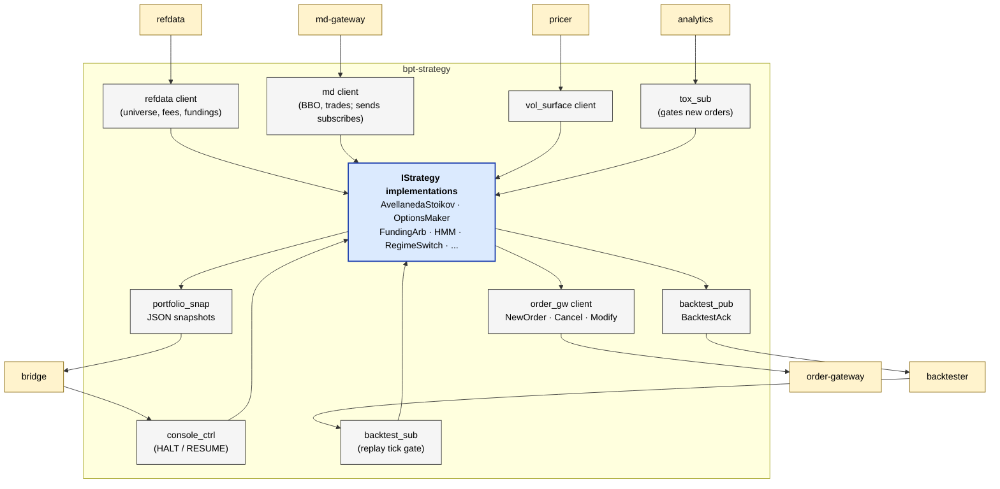

# bpt-strategy

The strategy framework. Consumes MD + refdata + vol surface + toxicity +
console control; runs one or more `IStrategy` implementations; sends orders
to bpt-order-gateway. The largest service by domain code — most of the
codebase under `strategy/strategy/` is the actual algos.

See [service-anatomy.md](../docs/service-anatomy.md) for the canonical service shape.

## At a glance



## Streams produced

| Stream | ID | Contents | Cadence |
|---|---|---|---|
| `order` | 3001 | `NewOrder`, `CancelOrder`, `ModifyOrder`, `AccountSnapshotRequest` | per order action |
| `md_control` | 2001 | `MdSubscribeBatch` (strategy is one of md-gateway's consumers) | on universe change |
| `refdata_control` | 1003 | `RefDataSubscriptionRequest` | on startup / universe change |
| `portfolio` | 9004 | JSON portfolio-snapshot blobs (to bridge) | ~10 Hz |
| `backtest_ack` | 9001 | `BacktestAck` (replay tick acked) | per replay tick |

## Streams consumed

| Stream | ID | Contents |
|---|---|---|
| `md_data` | 2002 | `MdBbo`, `MdTrade`, `MdOrderBook` |
| `md_ack_hb` | 2003 | Subscription acks + heartbeats from md-gateway |
| `refdata_snapshot` | 1001 | `RefDataSnapshot` |
| `refdata_delta` | 1002 | `RefDataDelta` |
| `refdata_status` | 1006 | `RefDataReady`, `RefDataError` |
| `fee_schedule` | 1004 | `FeeSchedule` |
| `funding_rate` | 1005 | `FundingRate` |
| `vol_surface` | 4001 | `VolSurface` |
| `exec_report` | 3002 | `ExecutionReport` (fills + lifecycle) |
| `account_snapshot` | 3004 | `AccountSnapshot` (positions + balances) |
| `heartbeat` | 3003 | `OrderGatewayHeartbeat` (venue connection status) |
| `toxicity` | 5001 | `ToxicityUpdate` |
| `console_control` | 9003 | 1-byte HALT (0x00) / RESUME (0x01) |
| `backtest_control` | 9002 | `BacktestControl` (replay-tick command) |

## Layers (which this service has)

| Layer | Status | Notes |
|---|---|---|
| Composition root | yes | `src/main.cpp` |
| Service | yes | `app/strategy_service.{h,cpp}`, `strategy_service_shutdown.cpp`, `strategy_service_backtest.cpp` |
| Bus | yes | `messaging/aeron_bus.{h,cpp}` — `StrategyBus` |
| Routing | **no** | strategy talks to one md-gateway, one order-gateway |
| Adapter | **no** | no exchange WebSocket |
| Wire | **no** | — |
| External codec | **no** | — |
| Pub/Sub (slow) | yes | api/aeron split for the 2 subs; client classes for compound flows |
| Pub (hot) | **no** | — |
| Internal codec | **no** | most decode is inline in client classes; no separate codec library |
| Domain logic | yes (largest) | `strategy/strategy/` (algos), `clock/` (startup gate, RTH), `order/` (order-gateway client + canonical resolver), `md/` (MD client), `refdata/` (refdata client + caches), `vol/` (vol surface client), `backtest/` (replay client), `console/` (portfolio snapshot publisher) |

## Special: client classes vs port pattern

Strategy's MD + refdata + order-gateway + vol-surface paths are wrapped in
"client" classes (`md::AeronMdClient`, `refdata::AeronRefdataClient`,
`order::AeronOrderGatewayClient`, etc.) rather than the api/aeron split.
Why: these clients carry richer state (sequence tracking, request/response
matching, cached snapshots) than a pure port. Promoting each to a formal
port adds vtable cost for zero immediate test-seam payoff.

The two streams that DO use api/aeron split are the simple read-only
subscribers: `api::ConsoleControlSubscriber` and `api::ToxicitySubscriber`.

## Strategies included

Under `strategy/strategy/`:
- `AvellanedaStoikovStrategy` — full Stoikov '08 with drift / regime / queue suppression
- `OptionsMakerStrategy` — options market making with smile-fitted theos + embedded hedger
- `FundingArbStrategy` — paired spot + perp delta-neutral
- `PassiveMakerStrategy` — three-knob symmetric quoter (worked example)
- `OFIStrategy`, `MomentumStrategy`, `VwapReversionStrategy`, `RegimeSwitchStrategy`, `HmmStrategy`, `ShortVolStrategy`

Each implements `IStrategy` (virtual). One strategy per binary invocation
via config; `STRATEGY` env var selects which one to instantiate.

## Test seams

- Unit tests: `tests/unit/` — per-component (PnL tracker, queue tracker, regime detector, etc.)
- Strategy tests: `tests/strategy/` — per-strategy behaviour with FakeMdClient / FakeOrderGateway

## Reading order

1. `src/main.cpp` — strategy selection from config.
2. `app/strategy_service.{h,cpp}` — main poll loop.
3. `messaging/aeron_bus.{h,cpp}` — `StrategyBus` shape, what each stream maps to.
4. `strategy/i_strategy.h` — the strategy contract.
5. Pick a strategy: `strategy/strategy/avellaneda_stoikov_strategy.h` is the most worked-out example.
6. `order/i_order_gateway_client.h` + `order/aeron_order_gateway_client.h` — outbound order surface.

## Build + test

```bash
bazel build //bpt-strategy:bpt-strategy
bazel test //bpt-strategy/...
```
