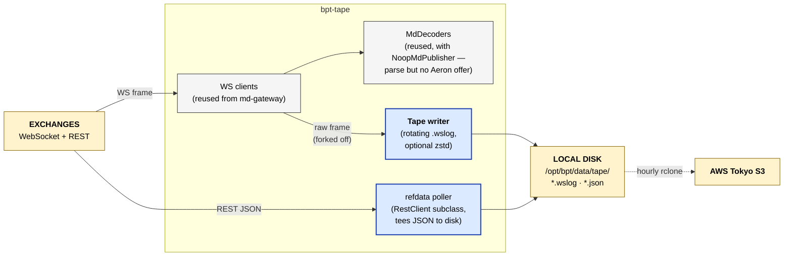

# bpt-tape

Market-data recorder. Subscribes to the same exchange WebSocket feeds as
bpt-md-gateway, but instead of normalising to SBE + publishing on Aeron,
writes the raw frames to disk for later replay (powering the
bpt-backtester-mono harness).

The "tape" in the name is the trading-floor term for a chronological record
of market data — what the New York Stock Exchange ticker tape was.

See [service-anatomy.md](../docs/service-anatomy.md) for the canonical service shape.

## At a glance



## Streams produced

None — tape is pure outbound to disk.

## Streams consumed

None — tape connects directly to exchange WS / REST, no Aeron involvement.

## Layers (which this service has)

| Layer | Status | Notes |
|---|---|---|
| Composition root | yes | `src/main.cpp` |
| Service | yes | `app/recorder_service.{h,cpp}` |
| Bus | **no** | no Aeron — tape doesn't publish or subscribe internally |
| Routing | **no** | per-adapter recording config; no routing layer |
| Adapter | yes (**reuses md-gateway's**) | `IAdapter` implementations are imported from bpt-md-gateway via Bazel dep |
| Wire | yes (**reuses md-gateway's**) | same WS clients as md-gateway |
| External codec | yes (**reuses md-gateway's**) | venue MD decoders parsed against a `NoopMdPublisher` |
| Pub/Sub | **no** | the equivalent layer is `io/tape.h` — the disk writer |
| Internal codec | **no** | — |
| Domain logic | yes | `io/` (Tape: rotating writer with zstd), `refdata/` (REST poller subclassing RestClient to tee bodies to disk), `metrics/` |

## How tape reuses md-gateway

bpt-tape doesn't reimplement venue WS clients or JSON decoders. It depends
on `bpt-md-gateway:md_gateway_lib` as a Bazel target and instantiates the
same `IAdapter` implementations with two differences:

1. The `Pub` template parameter is `NoopMdPublisher` (in
   `bpt-md-gateway` itself) — the publish chain inlines to nothing on the
   downstream side.
2. The adapter's `on_frame()` is hooked to fork every raw WS payload into
   a `Tape` writer before the (no-op) decode runs.

So the decoder still runs (catches format drift, validates the parse), but
no SBE is emitted and no Aeron offer happens. The recorder forks bytes off
*before* the decode so the on-disk format is the raw WS frame plus a
nanosecond timestamp.

## On-disk format

`io/tape.h` rotates a `.wslog` file per (venue, day, hour). Each record is:
```
[8 bytes: ns timestamp][4 bytes: payload length][N bytes: payload]
```
Optional zstd compression on rotated files. Format is replayable by
bpt-backtester (same decoders feed off it).

Refdata captures are JSON dumps from the venue REST responses, one file
per (venue, endpoint, day).

## Where tape sits in the bigger picture

- bpt-md-gateway: live → strategy. SBE on Aeron.
- bpt-tape: live → disk. Raw frames in .wslog.
- bpt-backtester-mono: disk → strategy. .wslog → same decoders → in-process pub.

Tape is the bridge between live and backtest. See
[`project_md_recorder`](../site/docs/architecture.md) and bpt-backtester's
README for the full picture.

## AWS sync

Tapes sync to AWS Tokyo S3 hourly via rclone, scheduled in
`deploy/scripts/sync-tape-to-s3.sh`. Storage backend is documented in the
[bpt-tape long-term storage memory](../site/docs/architecture.md).

## Reading order

1. `src/main.cpp`
2. `app/recorder_service.{h,cpp}` — adapter list, lifecycle.
3. `io/tape.h` — rotating writer.
4. `refdata/refdata_poller.h` — REST tee-to-disk.
5. The reused md-gateway adapter code is in `../bpt-md-gateway/include/md_gateway/adapter/`.

## Build + run

```bash
bazel build //bpt-tape:bpt-tape
./bazel-bin/bpt-tape/bpt-tape --config bpt-tape/config/bpt-tape.<stack>.toml
```
