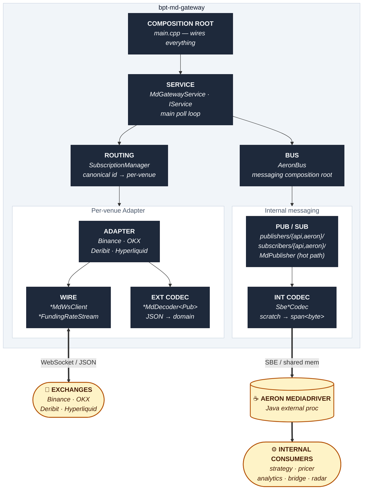
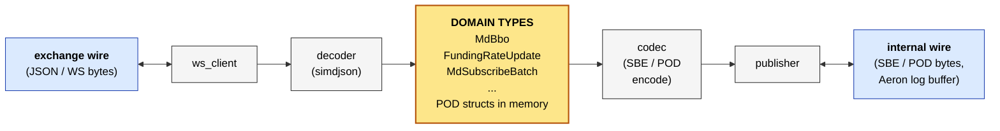

# Anatomy of a bpt-* service

Every bpt-* C++ service follows the same layered shape. Services drop layers
they don't need (a pure consumer like `bpt-pricer` has no adapter layer), but
the canonical full stack is below. If you remember this picture, you can read
any new service in 5 minutes.

This document complements [`architecture.md`](architecture.md): that one shows
the system at a glance (services + the Aeron fabric between them); this one
shows what's *inside* one service.

## The canonical full stack (bpt-md-gateway — has every layer)



> **Rendering this:** GitHub renders Mermaid inline automatically. In VS Code,
> install `bierner.markdown-mermaid` (Markdown Preview Mermaid Support) — one-click,
> no other config. Anywhere else, the raw text is the source-of-truth.

## Layer vocabulary

| Layer | Purpose | Stateful? | Example |
|---|---|---|---|
| **Composition root** | Wires everything in `main.cpp` | No | `main.cpp` |
| **Service** | App lifecycle, poll loop, IService impl | Yes | `MdGatewayService` |
| **Bus** | Factory + struct for messaging concretes | No | `AeronBus::build()` |
| **Routing** | Maps domain → venue (md-gateway only) | Yes | `SubscriptionManager` |
| **Adapter** | One per external venue, owns the WS + decoder | Yes | `BinanceMdAdapter` |
| **Wire** | Concrete transport (WS / HTTPS / binary) | Yes | `BinanceMdWsClient` |
| **External codec** | Venue JSON ↔ domain types | Stateful for decode | `BinanceMdDecoder<Pub>` |
| **Pub/Sub** | Port + Aeron concrete pair | No (mostly) | `aeron::FundingRatePublisher` |
| **Internal codec** | SBE/POD ↔ domain types | No (pure) | `SbeFundingRateCodec` |

## The four abstraction "halves" and what each owns



The domain types (`MdBbo`, `FundingRateUpdate`, `MdSubscribeBatch`, etc.) are
the **pivot point** of the whole pipeline. They are plain POD structs with no
encoding format attached — neither JSON nor SBE knows about them; both sides
translate to/from them. The adapter side translates external wire ↔ domain;
the codec side translates domain ↔ internal wire. **They never meet directly
— only through the domain object.**

Why this matters:
- Exchange JSON schemas change (Binance adds a field) → only `*MdDecoder` changes.
- Internal SBE schema evolves (we add a field to `FundingRate`) → only the SBE codec changes.
- Domain types stay stable because they are your service-to-service contract,
  not your wire-to-wire contract.

## How other service shapes differ

The canonical shape is "external-facing service" (md-gateway, order-gateway,
refdata, pms). Other services drop layers depending on whether they talk to
external venues:

| Service | Has adapter+wire+ext.codec? | Notes |
|---|---|---|
| `bpt-md-gateway` | yes (4 venues) | The full template |
| `bpt-order-gateway` | yes (4 venues) | Symmetric, but adapter's ext.codec dominated by encoders (action encoders, request signers) |
| `bpt-refdata` | yes (4 venues) | Wire is HTTPS not WS; cadence is one-shot + periodic refresh |
| `bpt-pms` | yes (1 venue) | Same as refdata; smaller surface |
| `bpt-pricer` | **no** | Pure consumer — composition → service → bus → pub/sub → codec |
| `bpt-strategy` | **no** | Same as pricer + a big domain layer (`strategy/strategy/`) |
| `bpt-analytics` | **no** | Same as pricer |
| `bpt-radar` | **no** | Same as pricer |
| `bpt-bridge` | **special** | Internal Aeron consumer + a WS *server* (not WS client) emitting JSON to the console |
| `bpt-tape` | **no** | Same as pricer + a disk-writer layer instead of a publisher |

## Hot path vs slow path

Inside the pub/sub layer there are two dispatch styles:

**Hot path** (~µs per call, ~kHz rates) — md-gateway's tick chain:

```
BinanceMdDecoder<Pub>
   │   pub.publish(MdBbo)    ← static dispatch, no vtable
   ↓
ValidatingPublisher<MdPublisher>
   │   inner_.publish(MdBbo) ← static dispatch
   ↓
MdPublisher
   │   tryClaim + SBE encode in-place ← zero-copy into Aeron log buffer
   ↓
Aeron log buffer
```

- All template-composed (`template <md::MdSink Pub>`)
- Zero vtable hops
- `MdPublisher` writes directly into the Aeron log buffer (no scratch)
- Constrained by the `md::MdSink` / `md::MdPublisher` concepts

**Slow path** (~µs per call, ≤ Hz rates) — funding rates, status, acks,
account snapshots, control batches, everything else:

```
caller (e.g. adapter callback)
   │   api_pub_->publish(domain)   ← vtable hop #1
   ↓
api::FundingRatePublisher (virtual port)
   │ dispatched to aeron::FundingRatePublisher
   ↓
aeron::FundingRatePublisher
   │   codec_.encode(domain, scratch)   ← uses Codec<C, T> concept
   │   publisher_.offer(bytes)
   ↓
Aeron log buffer (Aeron's own internal copy)
```

- Virtual port + Aeron concrete (api/aeron split)
- One vtable hop per call (~3 ns)
- Stack-allocated scratch buffer, codec writes into it
- Codec satisfies `bpt::common::codec::Codec<C, T>` concept

Rule of thumb: **template composition + concepts for hot path; virtual ports
+ codecs for slow path.** The Aeron stream is the same in both cases; only the
in-process dispatch differs.

## Compile-time contracts (concepts)

Three named contracts live across the codebase:

| Concept | Where | Constrains |
|---|---|---|
| `bpt::common::codec::Codec<C, T>` | `bpt-common/include/bpt_common/codec/codec.h` | All slow-path SBE/POD codecs |
| `bpt::md_gateway::md::MdSink<P>` | `bpt-md-gateway/include/md_gateway/md/md_publisher_concept.h` | Venue MD decoders' `Pub` template param |
| `bpt::md_gateway::md::MdPublisher<P>` | same file | `ValidatingPublisher<Inner>`'s `Inner` template param |

Every codec class self-verifies its conformance with
`static_assert(Codec<C, T>)` next to its declaration. `MdPublisher` does the
same: `static_assert(md::MdPublisher<MdPublisher>)` in its header.

Concepts cluster at the **template boundaries**:
- External decoder's `Pub` template param → constrained by `MdSink`.
- Internal codec's `C` template param (used in `static_assert`) → checked against `Codec<C, T>`.

Everywhere else uses **runtime polymorphism** (virtual ports) or **concrete
classes** — neither has a template parameter to constrain, so no concept
applies.

## File / folder map (md-gateway)

```
bpt-md-gateway/include/md_gateway/
├── app/
│   └── md_gateway_service.h          ← SERVICE layer (IService impl)
├── adapter/                          ← EXTERNAL SIDE
│   ├── common/
│   │   ├── i_adapter.h                 adapter interface (virtual)
│   │   ├── adapter_base.h              template base owning IO + publisher threads
│   │   └── json_decoder_base.h         shared simdjson parser scaffolding
│   ├── binance/
│   │   ├── binance_md_ws_client.h    ← WIRE
│   │   ├── binance_md_decoder.h      ← EXTERNAL CODEC (decode side, JSON → domain)
│   │   ├── binance_md_encoder.h      ← EXTERNAL CODEC (encode side, outbound subscribe URL)
│   │   └── binance_md_adapter.h      ← ADAPTER (owns the above)
│   └── (okx, deribit, hyperliquid: same shape)
├── md/                               ← HOT-PATH MD MACHINERY
│   ├── md_types.h                      domain types (MdBbo, MdTrade, MdOrderBook)
│   ├── md_encoder.h                    zero-copy SBE encode used inside MdPublisher
│   ├── md_publisher_concept.h          MdSink / MdPublisher concepts
│   ├── md_validator.h                  validation on the tick path
│   ├── validation_drop_breaker.h       circuit breaker
│   └── validating_publisher.h          template decorator wrapping MdPublisher
├── messaging/                        ← INTERNAL SIDE
│   ├── aeron_bus.h                     BUS layer (composition root for messaging)
│   ├── streams.h                       stream-id constants
│   ├── publishers/
│   │   ├── api/                        virtual ports
│   │   ├── aeron/                      concretes (own Codec<C,T> instances)
│   │   └── md_publisher.h              hot-path publisher (uses md_encoder.h)
│   ├── subscribers/
│   │   ├── api/                        virtual ports
│   │   └── aeron/                      concretes (decode SBE inline)
│   └── codecs/                       ← INTERNAL CODECS (Codec<C,T> conforming)
│       ├── sbe_funding_rate_codec.h
│       ├── sbe_instrument_stats_codec.h
│       └── ... (one per outbound SBE message type)
└── subscription/
    └── subscription_manager.h        ← ROUTING layer
```

## When you open a new service

1. Find `main.cpp` — that's the composition root. It tells you what gets wired up.
2. Find `*Service` — that's the lifecycle owner.
3. Find `messaging/aeron_bus.h` — that's the messaging composition root. Look at the `*Bus` struct: each field tells you one stream the service produces or consumes.
4. If it's external-facing, find `adapter/common/` — that's where the venue-agnostic adapter scaffolding lives.
5. If you see `messaging/codecs/` with files matching `Codec<C, T>` static_asserts, that's the slow-path SBE encoding side.
6. If you see `template <md::MdSink Pub>` anywhere, that's the hot path.

Everything else falls into one of those bins. If a file doesn't fit, it's
probably a domain-logic file (e.g. `pricer/pricing/svi.cpp`,
`strategy/strategy/avellaneda_stoikov_strategy.cpp`) — orthogonal to the
service shape.
