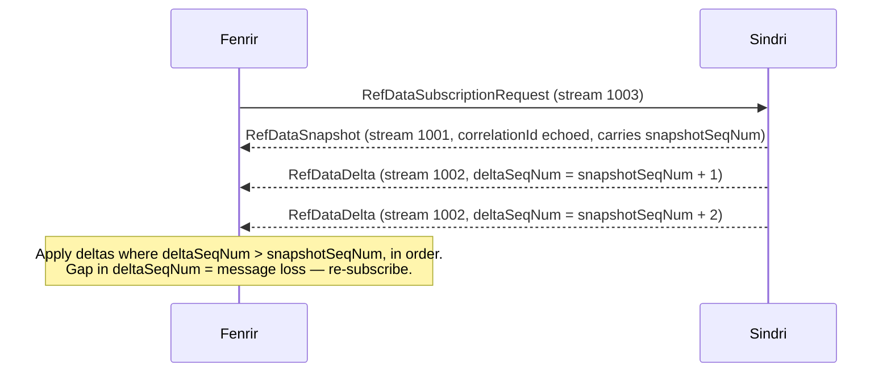

# bifrost-protocol

SBE (Simple Binary Encoding) message schemas and generated C++ codecs for all inter-service communication in the trading system. Both sides of each channel include this repo and use the same generated headers — no independent codec implementations, no drift.

Transport layer: [bifrost-fabric](../bifrost-fabric) (Aeron).

---

## Messages

| Template ID | Message | Stream | Direction | Description |
|---|---|---|---|---|
| 1 | `RefDataSubscriptionRequest` | 1003 | Fenrir → Sindri | Subscribe to instrument snapshot |
| 2 | `RefDataSnapshot` | 1001 | Sindri → Fenrir | Full instrument snapshot (group message) |
| 3 | `RefDataDelta` | 1002 | Sindri → Fenrir | Incremental update or heartbeat |
| 4 | `MdSubscribeBatch` | 2001 | Fenrir → Huginn | MD subscription request |
| 5 | `MdSubscriptionAck` | 2003 | Huginn → Fenrir | Per-instrument subscription acknowledgement |
| 6 | `MdSubscriptionHeartbeat` | 2003 | Huginn → Fenrir | Per-instrument keepalive (when no data) |
| 7 | `MdMarketData` | 2002 | Huginn → Fenrir | BBO (best-bid/offer) snapshot |
| 8 | `MdTrade` | 2002 | Huginn → Fenrir | Trade print |
| 9 | `MdServiceHeartbeat` | 2003 | Huginn → Fenrir | Service-level keepalive |
| 10 | `NewOrder` | 3001 | Fenrir → Heimdall | Place a new order |
| 11 | `CancelOrder` | 3001 | Fenrir → Heimdall | Cancel existing order |
| 12 | `CancelAll` | 3001 | Fenrir → Heimdall | Cancel all orders (optionally filtered) |
| 13 | `ModifyOrder` | 3001 | Fenrir → Heimdall | Modify price/qty |
| 14 | `ExecutionReport` | 3002 | Heimdall → Fenrir | Fill/cancel/reject |
| 15 | `OrderGatewayHeartbeat` | 3003 | Heimdall → Fenrir | Gateway liveness |
| 16 | `RefDataReady` | 1006 | Sindri → Fenrir | All adapters completed snapshot |
| 17 | `RefDataError` | 1006 | Sindri → Fenrir | Runtime error |
| 18 | `FundingRate` | 1005 | Sindri → Fenrir | Perpetual funding rate update |
| 19 | `FeeSchedule` | 1004 | Sindri → Fenrir | Exchange/instrument fee schedule |
| 20 | `MdOrderBook` | 2002 | Huginn → Fenrir | Top-N order book snapshot |
| 21 | `VolSurface` | 4001 | Surtr → Fenrir | Implied-volatility surface snapshot |
| 22 | `SurtrHeartbeat` | 4002 | Surtr → Fenrir | Service-level keepalive |
| 23 | `SurtrReady` | 4002 | Surtr → Fenrir | Startup ready signal |

### Snapshot/delta flow (refdata)



Apply deltas with `deltaSeqNum > snapshotSeqNum`. A gap in `deltaSeqNum` means message loss — re-subscribe.

---

### RefDataReady.exchangesLoaded bitmask

`RefDataReady` (template ID 16, stream 1006) carries an `exchangesLoaded` bitmask indicating which exchange adapters completed their initial snapshot:

| Bit | Mask | Exchange |
|---|---|---|
| 0 | `0x01` | BINANCE |
| 1 | `0x02` | OKX |
| 2 | `0x04` | HYPERLIQUID |

`0x07` means all three exchanges are ready. Fenrir halts if `(exchangesLoaded & configured_mask) != configured_mask`.

---

## Repository layout

```
schema/                         SBE schema XML (source of truth)
generated/cpp/bifrost_protocol/ Generated C++ headers (committed)
scripts/
  download-sbe-tool.sh          Fetches sbe-all-1.30.0.jar from Maven Central
  generate.sh                   Regenerates generated/ from schema/
  install-hooks.sh              Installs the pre-commit hook (run once after clone)
tools/                          sbe-tool JAR lives here (gitignored)
cmake/                          CMake package config template
CMakeLists.txt                  INTERFACE library target bifrost::protocol
```

---

## Setup (once after cloning)

```bash
./scripts/download-sbe-tool.sh   # requires curl, JDK 17+
./scripts/install-hooks.sh
```

The pre-commit hook automatically regenerates `generated/` when `schema/` is staged, and blocks the commit if the output changed so you can review and re-stage it.

---

## Regenerating codecs

Only needed after editing `schema/bifrost-protocol.xml`:

```bash
./scripts/generate.sh
git add schema/ generated/
git commit
```

---

## Consuming in CMake

```cmake
# As a subdirectory
add_subdirectory(path/to/bifrost-protocol)
target_link_libraries(my_target PRIVATE bifrost::protocol)
```

Then include headers:

```cpp
#include "bifrost_protocol/MessageHeader.h"
#include "bifrost_protocol/RefDataSubscriptionRequest.h"
#include "bifrost_protocol/RefDataSnapshot.h"
#include "bifrost_protocol/RefDataDelta.h"
#include "bifrost_protocol/RefDataReady.h"
#include "bifrost_protocol/MdSubscribeBatch.h"
#include "bifrost_protocol/MdMarketData.h"
// ... other messages as needed
```

Requires C++17. The library is header-only — no compilation step.

---

## Usage examples

### Encoding a subscription request (Fenrir)

```cpp
#include "bifrost_protocol/RefDataSubscriptionRequest.h"

using namespace bifrost::protocol;

// Allocate a buffer (stack or Aeron offer buffer)
constexpr std::size_t bufLen =
    RefDataSubscriptionRequest::computeLength(/*instrumentsLength=*/2);
std::array<char, bufLen + MessageHeader::encodedLength()> buf{};

RefDataSubscriptionRequest req;
req.wrapAndApplyHeader(buf.data(), 0, buf.size())
   .correlationId(42)
   .timestampNs(nowNs());

auto &instruments = req.instrumentsCount(2);
instruments.next().putSymbol("BTC-USDT-PERP").putExchange("BINANCE");
instruments.next().putSymbol("ETH-USDT-PERP").putExchange("BINANCE");
```

### Decoding a delta (Fenrir)

```cpp
#include "bifrost_protocol/RefDataDelta.h"

using namespace bifrost::protocol;

// buf/offset come from Aeron fragment handler
MessageHeader hdr(buf, offset, bufLen, 0);
RefDataDelta delta;
delta.wrapForDecode(buf, offset + MessageHeader::encodedLength(),
                    hdr.blockLength(), hdr.version(), bufLen);

switch (delta.updateType()) {
    case DeltaUpdateType::ADD:
    case DeltaUpdateType::MODIFY:
        // upsert delta.instrumentId() with new fields
        break;
    case DeltaUpdateType::REMOVE:
        // remove delta.instrumentId() from local store
        break;
}
```

### Decoding RefDataReady and validating exchanges (Fenrir)

```cpp
#include "bifrost_protocol/RefDataReady.h"

using namespace bifrost::protocol;

MessageHeader hdr(buf, offset, bufLen, 0);
RefDataReady ready;
ready.wrapForDecode(buf, offset + MessageHeader::encodedLength(),
                    hdr.blockLength(), hdr.version(), bufLen);

constexpr uint32_t CONFIGURED_MASK = 0x07; // BINANCE | OKX | HYPERLIQUID
if ((ready.exchangesLoaded() & CONFIGURED_MASK) != CONFIGURED_MASK) {
    g_running = 0; // halt — not all expected exchanges are ready
}
```

---

## Schema versioning

| Field | Value |
|---|---|
| Schema ID | 1 |
| Schema version | 9 (semantic 1.9.0) |
| Byte order | little-endian |
| C++ namespace | `bifrost::protocol` |
| SBE tool | Real Logic SBE 1.30.0 |

When adding new fields to existing messages, increment `version` in the schema and use `sinceVersion` on the new fields so older decoders skip them safely.
