# bpt-core monitoring

Operational health monitoring for the bpt-core services. Prometheus scrapes
`bpt-refdata` / `bpt-md-gateway` / `bpt-order-gateway` directly on their metrics ports; Grafana
renders dashboards from Python source via [grafanalib](https://github.com/weaveworks/grafanalib).

This layer is **ops only** — service up/down, exchange connectivity,
order-ack latency, error counters. PnL / fills / order-book visualisation
live in the bpt-core React console, not here.

## Observability stack

```mermaid
architecture-beta
    group bpt(server)[bpt core services]
    group monitor(cloud)[monitoring host]

    service mdgw(server)[md gateway] in bpt
    service ogw(server)[order gateway] in bpt
    service rdata(server)[refdata] in bpt
    service strat(server)[strategy] in bpt
    service tape(database)[tape] in bpt

    service prom(logos:prometheus)[Prometheus] in monitor
    service graf(logos:grafana)[Grafana] in monitor
    service alert(logos:alertmanager)[Alertmanager] in monitor

    service s3(logos:aws-s3)[AWS S3 Tokyo]
    service ops(logos:linux-tux)[on call]

    mdgw:R --> L:prom
    ogw:R --> L:prom
    rdata:R --> L:prom
    strat:R --> L:prom
    prom:R --> L:graf
    prom:B --> T:alert
    alert:R --> L:ops
    graf:B --> T:ops
    tape:R --> L:s3
```



## Layout

```
monitoring/
├── docker-compose.yml           # prometheus + grafana
├── prometheus.yml               # scrape config, 5s interval
├── provisioning/
│   ├── datasources/prometheus.yml
│   └── dashboards/bpt.yml       # file-based dashboard provider
├── dashboards/                  # grafanalib source (Python)
│   └── bpt_system_overview.dashboard.py
├── generated/                   # rendered dashboard JSON (gitignored)
├── Makefile
└── requirements.txt             # grafanalib
```

Dashboards are **design-as-code**: edits made in the Grafana UI are read-only
and get overwritten on next provisioning reload. To change a dashboard, edit
the `.dashboard.py` source and re-render.

## First-time setup

```bash
cd monitoring
make venv          # creates .venv and installs grafanalib
```

## Everyday workflow

```bash
make               # render all dashboards: dashboards/*.py → generated/*.json
make up            # bring up prometheus + grafana via docker-compose
make reload        # re-render + nudge Grafana to rescan provisioning
make down          # stop the stack
```

Grafana: <http://localhost:3000> (anonymous admin, no login form).
Prometheus: <http://localhost:9090>.

## Adding a dashboard

1. Create `dashboards/foo.dashboard.py`. The file **must** end in
   `.dashboard.py` and **must** define a module-level variable named
   `dashboard` — that's the naming convention grafanalib's
   `generate-dashboard` CLI uses to locate the definition.
2. `make` — grafanalib renders it to `generated/foo.json`.
3. `make reload` — Grafana's file provider picks it up within 30 s.

## Metric name conventions

| Service  | Port | Prefix        |
|----------|------|---------------|
| bpt-refdata   | 9101 | `refdata_`     |
| bpt-md-gateway   | 9102 | `bpt_md_gateway_`    |
| bpt-order-gateway | 9103 | `bpt_order_gateway_` |
| fenrir   | 9104 | *(no-op stub)* |

Fenrir's `metrics.h` is currently a no-op — no HTTP server is started and no
`fenrir_*` metrics are registered. Swap in the real prometheus-cpp
implementation before adding fenrir to any dashboard.

## Docker on WSL

If `docker compose up` fails with "command not found", you need Docker
Desktop's WSL integration enabled (Docker Desktop → Settings → Resources
→ WSL integration → toggle on for your distro), or install `docker-ce`
directly inside WSL.
